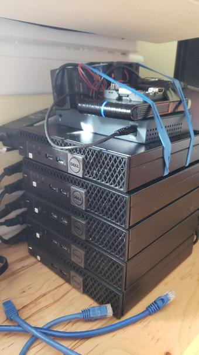
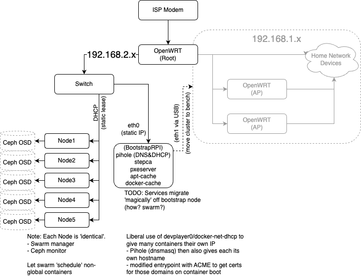

My cluster leads an exciting life... Having ansible, reflashing the entire home lab has been a regular occurrence; its rather satisfying to be able to wipe the entire slate clean and start from scratch on a drop of a hat.

The cluster is doing its 'job', its teaching me lots; 'ah, thats why they did it this way or that way'.. 

I've scrounged old parts, soldered homemade powersupply out an old laptop power-brick and a bunch of LM2596 boards, to supply 5v to a raspberry, network switch and a sata enclosure; also turned the pi into a router.. Oh.. and the essential piece of hardware. The Blue Rubber Band. Rubber band is essential for electrons to flow!

 

I then patched `devplayer0/docker-net-dhcp` plugin for swarm, installed ceph, wrote my own `docker-volume-rbd` pluggin... might I be finally close to having a stable docker-swarm?? I even have some breadcrumbs from trying to install k3s on top of docker-swarm (the blasphemy!! But more about docker-swarm as a base for cluster in another post..)

But... not quite. Networking. What does get annoying is me breaking my home network every time I re-flash my homelab. I already had pi that I was using for pihole (DNS and DHCP) and not much else. Since getting another pi for experimentation is ridiculously impossible, I started repurposing my pihole pi to be also used by the cluster. Taking down the pi, 'breaks the internet'!

And while reading about flannel (for k8s) I discovered what keepalived really does... Tinkered more with networking. Given me more ideas. Time to redesign the network now that I know slightly more how it works.

# The Hardware

Back to basics.. philosopy. I had several considerations when building this out.

- Resilience:
  - I don't need (as far as I know now 😄 ) any 'uptime' guarantee from my services. 
    - "Service mostly up but if reboot is required, no problem"
    - No need for multiple copies of a service (in general) for uptime guarantee (some exceptions)
- This project is for "fun". Don't loose 'work'
    - Storage must be reliable
    - Infrastructure-as-Code (mostly ansible), checked into github 
- "Cheap hardware"
    - Used Dell machines (eBay)
    - RaspberryPi (supposedly cheap, had an unused one) for boostraping PXE.
    - OpenWRT on a cheap router (vs pfsense/netgate)
    - Unmanaged 1GB switch
        - 1GB Ethernet (Cat5e)
- Ideally, low-power components
- Relatively available
    - "Replace failed hardware in a day or three and reflash with ansible" is acceptable in general
        - OK to improve if price is reasonable
    - Would had liked pfsense on Topton or Qotom (from aliespress), but its a single point of failure that takes weeks to replace
        - Expensive relative to cluster price, but might be worth it
        - Netgate available 'next day' but far too expensive for this effort
- Try to keep networking simple
    - Will attempt setup without a loadbalancer
    - All one subnet: REJECTED (need to isolate homelab experiments)

 

# The Software: Full Recovery Process in General

0. (All hardware in 'factory reset' state; i.e. unconnected and/or in cardboard boxes)
1. Assemble and connect (i.e. replacement?) hardware
    - (TODO) Automate OpenWRT config (ansible?)
2. Yubikeys
  - Init step CA certs into  (`step-yubikey-init`)
  - Init GPG for ssh-agent
3. Bootstrap the bootstrap machine!
    a. Flash vanilla Raspbian onto an SD card
    b. Replace firstboot.sh on the SD card and boot up Raspberry Pi
        - (SSH keys, systemd-networkd)
    c. Hit the RasperryPi with an ansible playbook
        - (Docker-compose, Pihole, PXEServer, Docker Registry cache, APT cache)
4. Hit the (powered-off) cluster with ansible playbook
    - (WakeOnLan -> PXE+CloudInit -> Docker Swarm -> Ceph)

# Infrastructure-as-Code, Bootstrapping Bare Metal and Off-the-Shelf parts

This is not a new problem, PXE existed for decades at this point and its automation has been attempted many times it seems. I discovered such efforts a bit too-little-too-late: 
- https://github.com/danderson/netboot and the like
- https://www.reddit.com/r/golang/comments/m49nls/netbootd_automate_os_provisioning_pxe_booting/

I had briefly considered a project that is Canonical-funded: MaaS. Before I knew much about PXE, TFTP and DHCP/BOOTP.. But @TechnoTim has recently posted a video about it so I gave it an honest try. After 3 days, time to give up. It seems raspberry pi and MaaS don't go together yet. I came across [this blog](https://reachablegames.com/tag/maas/) that convinced me that while MaaS is nice and shiny, I can live without it.

I might go back and experiment with PXE again, but for now, my own [pxeserver](https://github.com/vpaprots/pxeserver) will do the job just as well.

This made me reflect. When to use of the shelf parts? Writing my own components for the lab is often interesting and definitely educational. Once done though.. the more parts I create, the bigger the tangle to maintain? Or is that a simpler tangle then a complex product?

I am still on the fence about MaaS. And what about CEPH? Instead of rolling myself Ceph, what about Proxmox cluster which also has Ceph 'built in'? Or cephadm.. 

Seems like I have plenty of learning down the road to do.